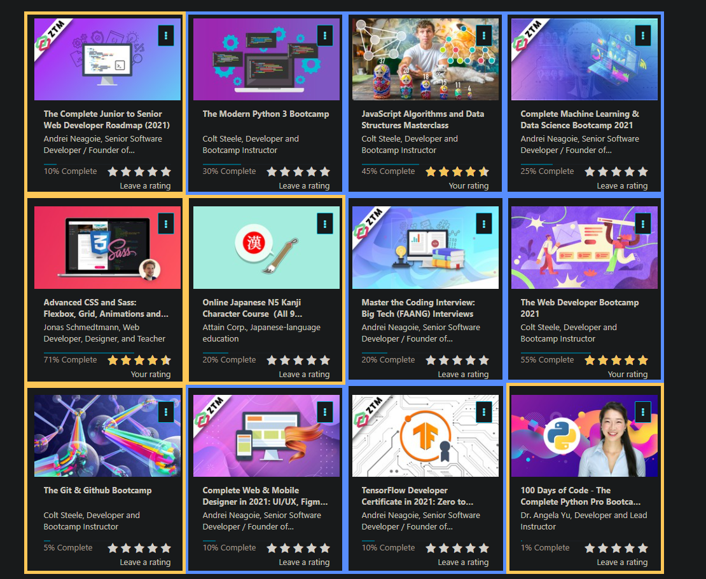

## Objectives

This round will have a heavy focus on learning and shall serve as a training ground designed to improve my current skillset and learn some new skills along the way. As such, my progress for each day will be guided by several Udemy courses I've selected beforehand. I strongly believe that I've set up a pretty solid selection of courses to help me jumpstart my mojo and set me up for success, gain a huge amount of valuable experience relevant to my career, and most importantly provide me with tons of project ideas until I feel confident enough to build my own projects from the ground up.

My objective for this round is simple: Complete as many of these courses as I can, making steady progress each day for the next 100 days. This includes, but is not limited to:
- Getting the *100% Complete* status on the course, and thus acquiring the Certificate of Completion from Udemy
- Completing the course projects

Here is my initial progress on the Udemy courses I've selected for this round:

I've also marked each course as follows:
- **BLUE** - Priority courses to complete (i.e. get 100% progress and complete the major course projects)
- **ORANGE** - Optional courses, but it would still be nice if I can also complete them within these 100 days

## Rationale

I've selected these courses to guide me for this round because I believe they'd supply me with valuable knowledge, and they also save me the effort of planning each project from scratch because each course has their own milestone projects designed to test and demonstrate my understanding of the course material, meaning I can immediately get to coding and not have to waste a lot of time trying to figure out what kind of project to do.

Priority courses:
1. [Complete Machine Learning & Data Science Bootcamp 2021](https://www.udemy.com/course/complete-machine-learning-and-data-science-zero-to-mastery/) - This course serves as an introduction to the basic concepts of Data Science and Machine Learning, and nicely illustrates the tools and resources commonly used in that field. I believe this one will help me understand the hows and whys of Data Science and Machine Learning.
2. [TensorFlow Developer Certificate in 2021: Zero to Mastery](https://www.udemy.com/course/tensorflow-developer-certificate-machine-learning-zero-to-mastery/) - This one serves as the "sequel" to the Data Science and Machine Learning course, and while I definitely need to complete the previous one first, I'm really excited to take on this course because TensorFlow is extremely relevant in my work right now :^)
3. [The Modern Python 3 Bootcamp](https://www.udemy.com/course/the-modern-python3-bootcamp/) - One of the courses I had in my backlog for quite a long time now, I'm taking this course not only because most Data Science and Machine Learning courses use Python in their course materials and projects, but also because I'm quite interested to see what more Python can offer and what kinds of awesome projects can I make.
4. [JavaScript Algorithms and Data Structures Masterclass](https://www.udemy.com/course/js-algorithms-and-data-structures-masterclass/) - This course is on my priority list for this round because I want to improve both my programming skills and problem solving skills, and I stongly believe that taking a course on Data Structures and Algorithms would set me on the right track to writing better code.
5. [Master the Coding Interview: Big Tech (FAANG) Interviews](https://www.udemy.com/course/master-the-coding-interview-big-tech-faang-interviews/) - I'm taking this course as a follow-on to the Data Structures and Algorithms Masterclass. It has a lot of advanced topics I'm really excited to code along and be able to solve the tougher problems offered in this course!
6. [The Web Developer Bootcamp 2021](https://www.udemy.com/course/the-web-developer-bootcamp/) - I've already completed the older version of this course, but it recently got such a massive update and I'm definitely liking the updated material so far. I think it would be really great to revisit the course projects (the course update still has the same projects, but revamped to use the more modern code taught in the new version of the course), and apply my new skills and make the project bigger and better!
7. [Complete Web & Mobile Designer in 2021: UI/UX, Figma, +more](https://www.udemy.com/course/complete-web-designer-mobile-designer-zero-to-mastery/) - Design is honestly one of my weaker points, and I hope to improve my design skills by taking this course and really understanding the topics and finally learn what makes good design good.

Optional courses:
1. [The Git & Github Bootcamp](https://www.udemy.com/course/git-and-github-bootcamp/) - I want to learn how to use Git properly, especially when I'll be working with teams. I feel the need to master Git beyond just the simple push/pull/commit commands.
2. [The Complete Junior to Senior Web Developer Roadmap (2021)](https://www.udemy.com/course/the-complete-junior-to-senior-web-developer-roadmap/) - With this course, I'm really just looking to fill in the gaps in my knowledge, and I think this course is diverse enough to give me some insight on what topics to focus on next.
3. [100 Days of Code - The Complete Python Pro Bootcamp for 2021](https://www.udemy.com/course/100-days-of-code/) - Has a really nice selection of Python projects, and again giving me some insight on what other cool stuff I can build with Python.
4. [Advanced CSS and Sass: Flexbox, Grid, Animations and More!](https://www.udemy.com/course/advanced-css-and-sass/) - Almost done with this one, just need to finish the last course project and hopefully apply whatever new skills I learn from the Web Designer course in this final project.
5. [Online Japanese N5 Kanji Character Course（All 9 lessons)](https://www.udemy.com/course/online-japanese-kanji-character-course/) - Not code-related, but yes, I'm also trying to learn some Japanese as a bit of a side-project :^)

## House Rules

1. I will not be actively timing my progress for each day, since my main focus for this round is to learn as much as I possibly can from the courses I've selected. Instead, I will be tracking my daily progress based on how many sections/exercises/code challenges I've completed on that day.
2. Since I've selected a pretty diverse range of topics for this round, I think it would be better if I make some sort of schedule every week to make sure I can direct my focus on one thing throughout each day, and ensure that I'm making steady progress in all of my priority courses. For now, here's a rough schedule for which courses I'll be focusing on for each day of the week:
   - **Mondays** and **Tuesdays**: Python/Machine Learning - Machine Learning is at the very top of the topics I want to learn right now, so I'm making sure I'm starting each week off making solid progress on these courses:
     - Complete Machine Learning & Data Science Bootcamp 2021
     - The Modern Python 3 Bootcamp
     - TensorFlow Developer Certificate in 2021: Zero to Mastery (will start once I've completed the Machine Learning and Data Science bootcamp)
   - **Wednesdays** and **Thursdays**: JavaScript Levelgrind - For this part of the week, I'll be dedicating my time to dive deeper into JavaScript and improve my problem solving skills in order to write better code. These are the courses I'll be doing on this part of the week:
     - JavaScript Algorithms and Data Structures Masterclass
     - Master the Coding Interview: Big Tech (FAANG) Interviews
   - **Fridays**, **Saturdays**, and **Sundays**: Projects Cardio - In true 100 Days of Code fashion, I'll also be applying the skills I've learned and do some really cool projects. I'm dedicating three days of the week for this because I know some of the projects I'll be doing will be really complex but also fun and exciting. Here's the outline of what I'll be doing on this part of the week:
     - Major projects on the other courses listed above
     - Complete Web & Mobile Designer in 2021: UI/UX, Figma, +more
     - The Web Developer Bootcamp 2021 (specifically the final YelpCamp project)
     - The rest of the Optional Courses
