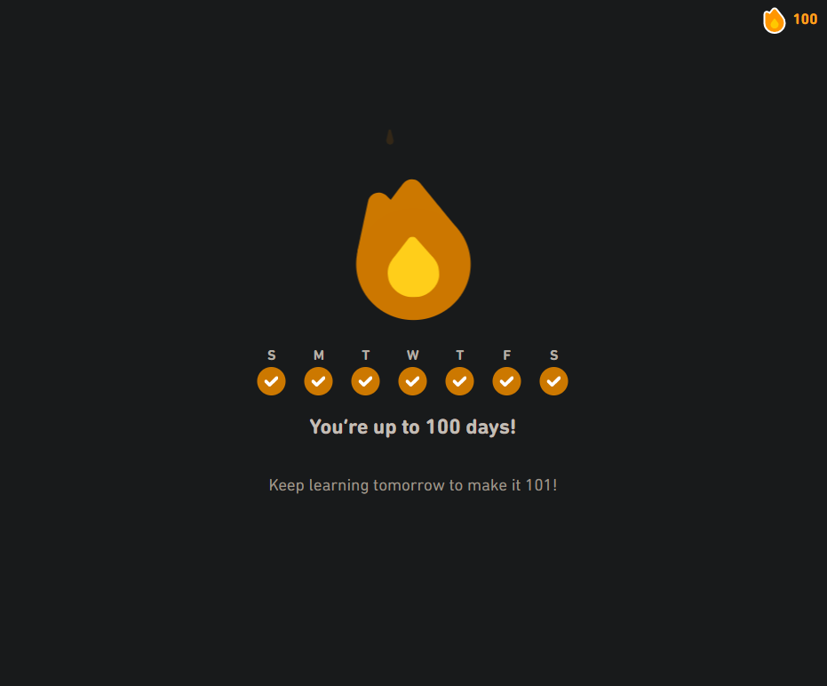

# 100 Days Of Code - Round 0 Log

### Day 0: Monday, May 3rd, 2021

**Today's Progress**: Did some prep work for the 100 Days of Code challenge, outlined my objectives and set up some house rules for this round.

**Thoughts:** I'm really excited to do this challenge! Outlining what exactly I need to do vs what I want to do for this round was a surprisingly big effort, especially with writing detiled explanations for my objectives and house rules. Documenting stuff like this is one of the skills I'm hoping to improve by doing this challenge, so let's see how much I can do for these next 100 days!

**Link to work:** You're reading it right now, silly!

### Day 1: Tuesday, May 3rd, 2021

**Today's Progress**: Set up the conda environment for the ZTM Machine Learning course, and started the Pandas Data Analysis section.

**Thoughts:** I think there's still a few small kinks to work out so that I can properly integrate different conda environments for different courses/projects into my VSCode workflows, but so far the one I created for the ML course has been working pretty well with minimal setup. I really love how I can put my notes and code together in one place using Jupyter Notebooks, and I certainly love being able to jump right in to working with Jupyter notebooks directly in VSCode!

**Link to work:** [Intro to pandas notebook](https://github.com/Insidiae/ztm-machine-learning/blob/main/1_pandas_data_analysis/introduction_to_pandas.ipynb)

### Day 2: Thursday, May 6th, 2021

**Today's Progress**: Reviewed and added notes for the the Singly Linked List section in the JS Data Structures course.

> **IMPORTANT NOTE/PEP TALK:** I Intentionally skipped a day and immediately broke my streak to hopefully remind future me that at the end of the day, it's the skills that we learn thoughout these courses that matters, and not how many days straight we can make progress. To anyone reading this: If you're starting to feel tired or burnt out, feel free to take a day or two off and just relax, and come back to the code/lessons hopefully with renewed excitement to learn, improve your skills, and git gud!

Now going back to my thoughts on this day's progress:

**Thoughts:** Again, I believe that being able to write good documentation is one of the most valuable skills a developer should have, and I'm practicing that skill by writing notes as detailed as I can and providing some helpful comments in my code while I go along this Data Structures and Algorithms course. It's definitely a skill that I believe I can only get better at through sheer amounts of practice, so here's to a lot more notes like these being written as I progress through the course!

**Link to work:** [Singly Linked List notes](https://github.com/Insidiae/js-algos-and-data-structs/blob/main/Linked%20Lists/1.%20Singly%20Linked%20List.md)

### Day 3: Friday, May 7th, 2021

**Today's Progress**: Revisited the new WebDev Bootcamp update and went though the Node and Express basics section.

**Thoughts:** Node + Express feels like something I've been neglecting for quite a while now so it's nice to revisit these updated sections to refresh my knowledge and better prepare for the updated YelpCamp project. I feel this is gonna be great, especially because I plan on adding my own personal twist once I (re-)do the YelpCamp project!

**Link to work:** [WDBC Revamp Backend repo](https://github.com/Insidiae/wdbc-backend-2)

### Day 4: Saturday, May 8th, 2021

**Today's Progress**: Finished the Express+EJS Templating and RESTful Routing sections from the WebDev Bootcamp

**Thoughts:** Pretty big progress for this day! I'm definitely getting the hang of using Express JS and RESTful routing again. Just a couple more sections left and I can really (re-)start the new YelpCamp project!

**Link to work:** [WDBC Revamp Backend repo](https://github.com/Insidiae/wdbc-backend-2)

### Day 5: Sunday, May 9th, 2021

**Today's Progress**: Finished the MongoDB and Mongoose sections from the WebDev Bootcamp

**Thoughts:** Another day of big progress! I've now caught up with (most of) what I need to know to get started with the YelpCamp project. I'm really excited to go through the revamped YelpCamp project sections next week!

**Link to work:** [WDBC Revamp Backend repo](https://github.com/Insidiae/wdbc-backend-2)

### Day 6: Monday, May 10th, 2021

**Today's Progress**: Finished the Pandas section lectures in the ZTM Machine Learning course.

**Thoughts:** Don't let the 1hr38min video lengths for the Pandas section fool you, this course is super jam-packed with useful information and I noticed it took me more than 3-4hrs total simply coding along (without even adding the notes in) with the videos sped up to 1.5x 🔥

Even though I only planned to simply sit back and code along with the lectures today, my progress was actually a bit bigger than I planned! I'm excited to go through the exercises tomorrow!

**Link to work:** [Intro to pandas notebook (TODO: Add notes)](https://github.com/Insidiae/ztm-machine-learning/blob/main/1_pandas_data_analysis/introduction_to_pandas.ipynb)

### Day 7: Tuesday, May 11th, 2021

**Today's Progress**: Added my notes and completed the exercices on the Pandas section of the ZTM Machine Learning course.

**Thoughts:** My note-taking skills still leave a lot to be desired, and I hope to keep improving it as I code along with these lectures. The exercises themselves were a breeze to go through mostly thanks to me coding along with the lecture videos. However, one minor hiccup I encountered today was that my Jupyter kernel was apparently using the wrong environment and thus wasn't able to detect and import `pandas` properly. Note to self: Always double-check my Python environments before getting started to code!

**Link to work:** [Intro to pandas notebook](https://github.com/Insidiae/ztm-machine-learning/blob/main/1_pandas_data_analysis/introduction_to_pandas.ipynb), [Pandas exercises notebook](https://github.com/Insidiae/ztm-machine-learning/blob/main/1_pandas_data_analysis/pandas-exercises.ipynb)

### Day 8: Wednesday, May 12th, 2021

**Today's Progress**: Finished the Doubly Linked Lists section of the Data Structures and Algorithms course.

**Thoughts:** Refactoring my code for the Singly Linked Lists and adding the `prev` pointers needed to implement Doubly Linked Lists seemed pretty complex at first, but I realized the beauty of working with Doubly Linked Lists is that the implementations for some methods became symmetrical to other methods, meaning the methods that deal with traversing the list forwards (i.e. `push()` and `pop()`) had essentially the same code as the methods that deal with traversing the list backwards (i.e. `unshift()` and `shift`). Pretty neat stuff!

**Link to work:** [Doubly Linked List notes](https://github.com/Insidiae/js-algos-and-data-structs/blob/main/Linked%20Lists/2.%20Doubly%20Linked%20List.md)

### Day 9: Thursday, May 13th, 2021

**Today's Progress**: Finished the Stacks and Queues section of the Data Structures and Algorithms course.

**Thoughts:** Again, implementing Stacks and Queues was made a lot simpler by having the codes for the Linked Lists already implemented. Catching up with the Udemy exercises was tricky though especially with the rather untested "Wild West" section, but having most of the code already written and ready to copy paste into the solution makes things a lot easier.

**Link to work:** [Stacks and Queues (TODO: Add notes)](https://github.com/Insidiae/js-algos-and-data-structs/tree/main/Stacks%20and%20Queues)

### Day 10: Friday, May 14th, 2021

**Today's Progress**: Started the YelpCamp MERN Project! Researched the basic how-tos, did the initial setup, and added some basic routes.

**Thoughts:** Not gonna lie, redoing the YelpCamp project using MERN stack and deviating a significant bit from the course lectures felt absolutely daunting at first, but with enough research on how to do the basic setup and the standard structure for MERN projects, once the initial setup is done and I implemented the first few routes, it felt really satisfying to get the pieces start falling into place and see everything working for the first time!

**Link to work:** [YelpCamp MERN repo](https://github.com/Insidiae/yelpcamp-mern)

### Day 11: Saturday, May 15th, 2021

**Today's Progress**: Finished the CRUD functionalities for the YelpCamp campgrounds.

**Thoughts:** There's definitely still some growing pains in learning how to communicate between my React frontend and the Node+Express backend, but so far I'm really digging how Axios streamlines sending the relevant HTTP requests for my CRUD functions!

**Link to work:** [YelpCamp MERN repo](https://github.com/Insidiae/yelpcamp-mern)

### Day 12: Sunday, May 16th, 2021

**Today's Progress**: MERN project prep part 4 - researched libraries to use on the YelpCamp project. Also did the Express Middlewares section on the WebDev Bootcamp in the meantime.

**Thoughts:** I'm planning to use TailwindCSS instead of Bootstrap for the revamped YelpCamp project, but I think there's still a bit of a learning curve I need to settle before I can fully use it on the project. My main concerns for now is how to implement some of the good ol' Bootstrap components like popups, alerts/toasts, and modals (mostly on the JS side of implementing those). Looking forward to exploring more on these stuff for next week!

**Link to work:** [WDBC Revamp Backend repo](https://github.com/Insidiae/wdbc-backend-2)

### Day 13: Monday, May 17th, 2021

**Today's Progress**: Finished the NumPy section on the ZTM Machine Learning course.

**Thoughts:** What a surprisingly massive section! As I've said before, the ZTM Machine Learning course is really concentrated with super useful information that it takes me more than twice the time just coding along with the course lectures (without even adding in my notes nor doing the end-of-section exercises), and masive props to the instructor for making the lectures interesting all the way through and really engaging to code along with!

**Link to work:** [Intro to NumPy notebook (TODO: Add notes)](https://github.com/Insidiae/ztm-machine-learning/blob/main/2_numpy/introduction_to_numpy.ipynb)

### Day 14: Tuesday, May 18th, 2021

**Today's Progress**: Finished the NumPy exercises on the ZTM Machine Learning course.

**Thoughts:** Numpy was a lot smoother (or should i say straightforward?) to work with than Pandas. Each question in the exercise had this really smooth transition to the next couple questions where the answer to the first one will be used in the next questions and so on. Really super fun to work with too!

**Link to work:** [NumPy exercise notebook](https://github.com/Insidiae/ztm-machine-learning/blob/main/2_numpy/numpy_exercises.ipynb)

### Day 15: Friday, May 21st, 2021

**Today's Progress**: Tried out Tailwind CSS as part of my YelpCamp MERN project.

**Thoughts:** Had to take a couple days off to try and fix my sleep schedule. Might have to take a couple more days before I fully get used to doing my projects earlier than usual so I can also sleep earlier!

As for the YelpCamp MERN project, I've decided to branch out a little bit more from the lectures and use Tailwind CSS instead of Bootstrap for the project. It still has that bit of a learing curve where I might have to re-implement some of the usual Bootstrap components like navbars/buttons/forms/etc. from scratch, but with the various free resources available online I think I can manage just that!

**Link to work:** [YelpCamp MERN repo](https://github.com/Insidiae/yelpcamp-mern)

### Day 16: Saturday, May 22nd, 2021

**Today's Progress**: Styled the basic routes of the YelpCamp MERN project using Tailwind CSS.

**Thoughts:** Thanks to the various components from TailwindComponents and the free components from the official Tailwind UI docs, I've styled the YelpCamp project to look decent using the card, button, icon, and form components I copied and tweaked from those resources. Looking good so far, though I definitely will have to address the issue of possibly DRY-ing up some of the commonly-used styles later. For that, I will have to research more about some best practices on reusing Tailwind components!

Oh, by the way: I've also gotten a 100-day streak on Duolingo for my Japanese language learning side-project!

I still have a lot of sections left to finish up on Duolingo, so here's to several more days on that streak!

**Link to work:** [YelpCamp MERN repo](https://github.com/Insidiae/yelpcamp-mern)

### Day 17: Sunday, May 23rd, 2021

**Today's Progress**: Added notes to my Data Structures and Algorithms and ZTM Machine Learning course notebooks.

**Thoughts:** Pretty chill day, though it helps to tie up some loose ends from these past days and add notes to my course notebooks. This also lets me review the topics covered in the course lectures and reinforce my knowledge in those topics, as well as sharpening my note-taking and documentation skills.

**Link to work:** [Stacks and Queues notes](https://github.com/Insidiae/js-algos-and-data-structs/tree/main/Stacks%20and%20Queues), [Intro to NumPy notebook (TODO: Add the rest of the notes)](https://github.com/Insidiae/ztm-machine-learning/blob/main/2_numpy/introduction_to_numpy.ipynb)

### Day 18: Monday, May 24th, 2021

**Today's Progress**: Started the Matplotlib section in ZTM Machine Learning course.

**Thoughts:** I'm definitely seeing how the Matplotlib workflow is similar to MATLAB, and I'm quite liking how well the workflows of Pandas, NumPy, and Matplotlib blend so well together. Tomorrow's going to be a big day finishing the rest of the Matplotlib section and exercises. I also hope I can add in the rest of my course notes tomorrow!

**Link to work:** [Intro to Matplotlib notebook (TODO: Finish section and add notes)](https://github.com/Insidiae/ztm-machine-learning/blob/main/3_matplotlib_plotting_and_data_visualization/introduction_to_matplotlib.ipynb)

### Day 19: Saturday, May 30th, 2021

**Today's Progress**: Finished the Error handling section on the Web Development Bootcamp, and added error handling and data validation logic on the YelpCamp MERN project.

**Thoughts:** I finally went full circle from starting to learn Async/Await from [this talk](https://www.youtube.com/watch?v=9YkUCxvaLEk), with the Express Error Handling section finally solving the last missing piece of using Async/Await with Higher-Order Functions to pass the errors to the error handling middlewares.

Going back to the YelpCamp MERN project, I still need to figure out how to manage error handling between the React frontend and the Express backend, and figure out which parts actually need the data validation logic.

**Link to work:** [WDBC backend repo](https://github.com/Insidiae/wdbc-backend-2), [YelpCamp MERN repo](https://github.com/Insidiae/yelpcamp-mern)

### Day 20: Wednesday, June 16th, 2021

**Today's Progress**: Finished the Binary Search Trees section of the Data Structures and Algorithms course.

**Thoughts:** Starting to get my mojo back, so I proceeded through the Data Structures and Algorithms course and made a lot of progress on Binary Search Trees. Using recursion to traverse the BST streamlined a lot of the code and makes it easier to understand how the BFS/DFS tracersal works. I still have a bit of trouble wrapping my head around how to remove nodes as there still seems to be a lot of edge cases to consider, and my current implementation still seems a bit hacky.

**Link to work:** [Binary Search Tree Code (TODO: Add notes)](https://github.com/Insidiae/js-algos-and-data-structs/blob/main/Binary%20Search%20Trees/src/binarySearchTree.js)
