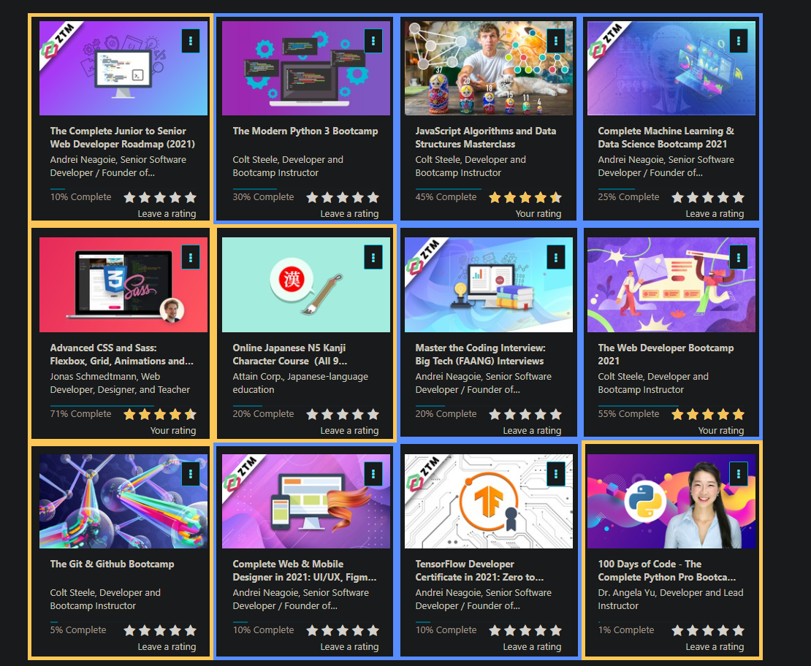

# #100DaysOfCode: Round 0 - Level Grind

You can check my progress logs for this round [here](./log.md), or you can also check [this one](./log-tldr.md) for a tl;dr version where I sum up my progress in a sentence or two.

For this round, I'll be heavily relying on various online courses to guide my progress throughout the next 100 days. My main focus for this round is to pick up new skills such as Python/Machine Learning while steadily improving my existing skillset. For a more detailed explanation of my objectives and self-imposed challenge rules for this round, see [house-rules.md](./house-rules.md).

## Why Online Courses?

To be honest, I'm relying on these courses this heavily for now because they already have a decent lineup of projects that I'll be doing as part of the course material. This means I save time on planning each and every project from scratch and get straight to coding up some really beautiful projects. For some of the topics such as Python and Machine earning though, I still have to learn them from scratch meaning I can use these online courses to jumpstart my skills in those fields.

## Courses I'm doing for this round

- **BLUE** - Priority courses to complete (i.e. get 100% progress and complete the major course projects)
- **ORANGE** - Optional courses, but it would still be nice if I can also complete them within these 100 days

### Current Progress

1.  ✅ [JavaScript Algorithms and Data Structures Masterclass](https://www.udemy.com/course/js-algorithms-and-data-structures-masterclass/): **100% Complete**
2.  ✅ [The Git & Github Bootcamp](https://www.udemy.com/course/git-and-github-bootcamp/): **100% Complete**
3.  ✅ [Master the Coding Interview: Big Tech (FAANG) Interviews](https://www.udemy.com/course/master-the-coding-interview-big-tech-faang-interviews/): **100% Complete**
4.  ✅ [Complete Machine Learning & Data Science Bootcamp 2021](https://www.udemy.com/course/complete-machine-learning-and-data-science-zero-to-mastery/): **100% Complete**
5.  ✅ [The Web Developer Bootcamp 2021](https://www.udemy.com/course/the-web-developer-bootcamp/): **100% Complete**
6.  ✅ [Advanced CSS and Sass: Flexbox, Grid, Animations and More!](https://www.udemy.com/course/advanced-css-and-sass/): **100% Complete**
7.  [The Complete Junior to Senior Web Developer Roadmap (2021)](https://www.udemy.com/course/the-complete-junior-to-senior-web-developer-roadmap/): 70% Complete
8.  [The Modern Python 3 Bootcamp](https://www.udemy.com/course/the-modern-python3-bootcamp/): 70% Complete
9.  [TensorFlow Developer Certificate in 2021: Zero to Mastery](https://www.udemy.com/course/tensorflow-developer-certificate-machine-learning-zero-to-mastery/): 19% Complete
10. [Complete Web & Mobile Designer in 2021: UI/UX, Figma, +more](https://www.udemy.com/course/complete-web-designer-mobile-designer-zero-to-mastery/): 10% Complete
11. [100 Days of Code - The Complete Python Pro Bootcamp for 2021](https://www.udemy.com/course/100-days-of-code/): 1% Complete
12. [Online Japanese N5 Kanji Character Course（All 9 lessons)](https://www.udemy.com/course/online-japanese-kanji-character-course/): 20% Complete

### Course Certificates earned in this round

1. [JavaScript Algorithms and Data Structures Masterclass](https://www.udemy.com/certificate/UC-fc91917f-b187-47fb-8b60-7329da6777a7/)
2. [Learning to Learn [Efficient Learning]: Zero to Mastery](https://www.udemy.com/certificate/UC-93fe6776-013f-4f2e-b03c-32c39cbc35a3/)
3. [Master the Coding Interview: Data Structures + Algorithms](https://www.udemy.com/certificate/UC-5b058aca-ee22-4e5f-acde-8eb356433242/)
4. [The Git & Github Bootcamp](https://www.udemy.com/certificate/UC-5d7a5381-30be-43b2-b6ac-59ca4867e999/)
5. [Master the Coding Interview: Big Tech (FAANG) Interviews](https://www.udemy.com/certificate/UC-e80f01f9-bd05-4613-856e-f653180112f3/)
6. [Complete Machine Learning & Data Science Bootcamp 2021](https://www.udemy.com/certificate/UC-d5e4c65e-1645-4aba-a502-b74eec122bf5/)
7. [freeCodeCamp's Scientific Computing with Python Certification](https://www.freecodecamp.org/certification/insidiae/scientific-computing-with-python-v7)
8. [The Web Developer Bootcamp 2021](https://www.udemy.com/certificate/UC-RU0ZW4GZ/)
9. [Advanced CSS and Sass: Flexbox, Grid, Animations and More!](https://www.udemy.com/certificate/UC-71708616-b9f7-48e1-9626-89b2fed51d5c/)
